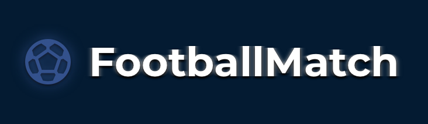
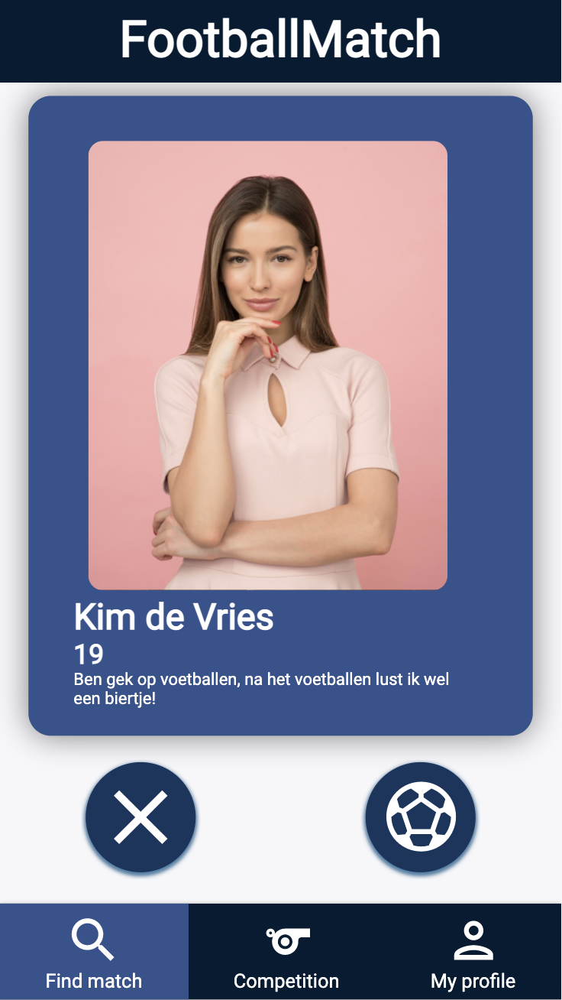
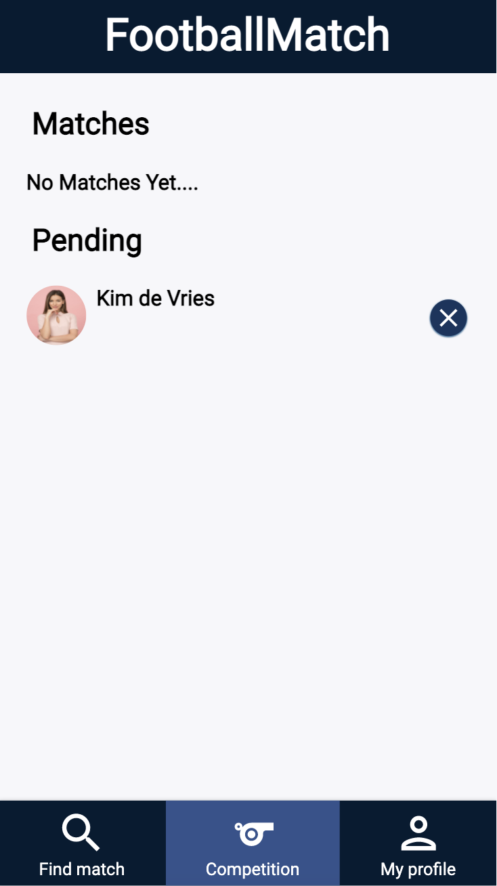
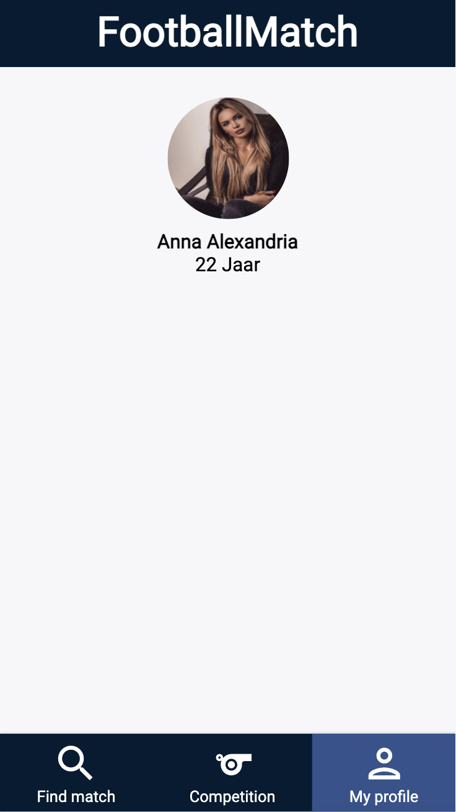
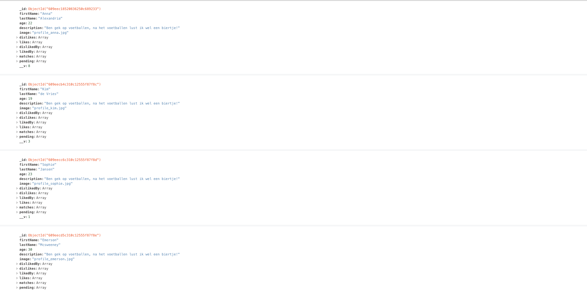

# 🎒 Blok Tech: ⚽️ FootballMatch ❤️ Like Feature


[![Contributors][contributors-shield]][contributors-url]
[![Issues][issues-shield]][issues-url]
[![MIT License][license-shield]][license-url]


<br />
<p align="center">
  <a href="https://github.com/jabirtisou/CMDBlokTech">
    
  </a>

  <h3 align="center">🎒 Blok Tech - ⚽️ FootballMatch</h3>

  <p align="center">
    🏭 Project Tech, 🏗️ Back-end, 🖌️ Front-end 2
    <br />
    <a href="https://github.com/jabirtisou/CMDBlokTech"><strong>Explore the docs »</strong></a>
    <br />
    <br />
    <a href="https://github.com/jabirtisou/CMDBlokTech">View Demo</a>
    ·
    <a href="https://github.com/jabirtisou/CMDBlokTech/issues">Report Bug</a>
    ·
    <a href="https://github.com/jabirtisou/CMDBlokTech/issues">Request Feature</a>
  </p>
</p>


<!-- ABOUT THE PROJECT -->
## 💭 About The Project

⚽️ FootballMatch is een ❤️ matching applicatie die gebruikers laat matchen om samen met elkaar een potje te gaan voetballen. 
Kom jij iemand tegen die jou aanspreekt? Klik op de football en wie weet krijg jij het terug voor een match 🥅!


### Built With

* [NodeJS](https://nodejs.dev/npm-global-or-local-packages)
* [Express](https://expressjs.com)
* [EJS](https://ejs.co/)
* [MongoDB](https://www.mongodb.com/products/compass)


<!-- GETTING STARTED -->
## 🛠 Getting Started

Om deze coole project te installeren. Volg deze instructies:


### 📡 Installation

Clone deze repository door middel van je terminal:
```
git clone https://github.com/jabirtisou/cmdbloktech.git
```
Vervolgens installeer je de packages met NPM:
```
npm install
```
En start je de server:
```
npm start
```
## 🎮 Usage
Bij het openen van Footballmatch log je in met jouw account. Na het inloggen kom je op de find match pagina. Hier kan jij je eventuele match vinden. Door het klikken op de voetballike komt de gebruiker bij je pending te staan.. Krijg jij een voetballike terug dan hebben jullie samen een match!



## 📂 Database 



<!-- LICENSE -->
## 🔗 License

Distributed under the MIT License. See `LICENSE` for more information.


<!-- CONTACT -->
## 📢 Contact

Your Name - Jabir Tisoudali 

Project Link: [https://github.com/jabirtisou/CMDBlokTech](https://github.com/jabirtisou/CMDBlokTech)


[contributors-shield]: https://img.shields.io/github/contributors/jabirtisou/CMDBlokTech.svg?style=for-the-badge
[contributors-url]: https://github.com/jabirtisou/CMDBlokTech/graphs/contributors
[forks-shield]: https://img.shields.io/github/forks/jabirtisou/CMDBlokTech.svg?style=for-the-badge
[forks-url]: https://github.com/jabirtisou/CMDBlokTech/network/members
[stars-shield]: https://img.shields.io/github/stars/jabirtisou/CMDBlokTech.svg?style=for-the-badge
[stars-url]: https://github.com/jabirtisou/CMDBlokTech/stargazers
[issues-shield]: https://img.shields.io/github/issues/jabirtisou/CMDBlokTech.svg?style=for-the-badge
[issues-url]: https://github.com/jabirtisou/CMDBlokTech/issues
[license-shield]: https://img.shields.io/github/license/jabirtisou/CMDBlokTech.svg?style=for-the-badge
[license-url]: https://github.com/jabirtisou/CMDBlokTech/blob/main/LICENSE
[linkedin-shield]: https://img.shields.io/badge/-LinkedIn-black.svg?style=for-the-badge&logo=linkedin&colorB=555
[linkedin-url]: https://www.linkedin.com/in/jabir-tisoudali/
